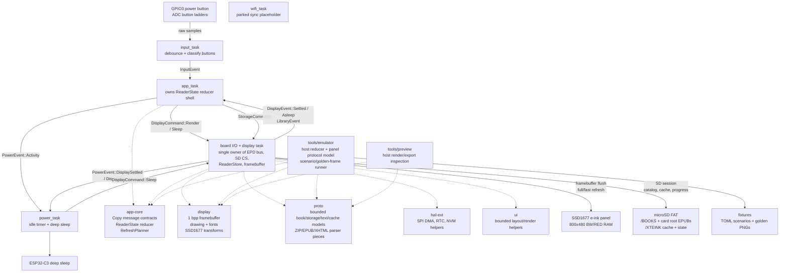

# xteink-x4-os architecture

This firmware is a bare-metal Rust bring-up for the Xteink X4 e-ink reader:
ESP32-C3, SSD1677, 800x480 monochrome panel, no PSRAM.

The design goal is not to imitate a desktop OS. It is a small data pipeline:

```text
buttons -> app state -> display command -> framebuffer -> SSD1677 RAM -> refresh -> sleep
```

## Current architecture diagram




## Rules

- `#![no_std]`, no heap allocation in firmware paths.
- One 48 KB 1 bpp framebuffer.
- Display ownership is single-writer: only `display_task` touches the EPD bus.
- Reader state ownership is single-writer: only `app_task` mutates page/menu state.
- Messages are small `Copy` values. Bulk bytes stay in caller-owned buffers.
- Power requests display sleep through `display_task`; it never touches SPI.
- Hardware assumptions live in one of two places:
  - X4 board wiring in `fw/src/main.rs` and `fw/src/tasks/input.rs`.
  - SSD1677 protocol in `display/src/epd.rs`.

## Workspace

```text
app-core/ app state reducer and Copy message contracts shared by firmware/tools
display/   framebuffer, drawing primitives, SSD1677 constants and address math
hal-ext/   thin async wrappers over ESP HAL peripherals
fw/        boot, Embassy executor, task wiring, board-owned peripherals
ui/        shared shell rendering plus ui::reading, the reader page-plan seam
           (page bounds, ink measurement, wrapping) used by fw and host tools
proto/     bounded book/storage/text/cache models plus ZIP/EPUB/XHTML parser pieces
tools/emulator/ host-side development emulator and scenario runner
```

## Embassy tasks

```text
app_task
  owns ReaderState
  InputEvent -> DisplayCommand::Render
  modes: Library, Reading, Chapters, Settings

board_io/display task
  owns EpdBus, SD CS, ReaderStore, and Framebuffer
  DisplayCommand::Render -> pure framebuffer render from the current ReaderStore snapshot
  StorageCommand::* -> serialized SD/FAT/catalog/cache work on the shared SPI bus
  DisplayCommand::Sleep -> sleep screen full refresh -> SSD1677 deep sleep -> PowerEvent::DisplayAsleep
  sends DisplayEvent::Settled to app_task when render completes

input_task
  polls GPIO3 and ADC ladders
  debounced ADC/power edges -> reader Button actions -> InputEvent

power_task
  observes activity and display-settled events
  asks display_task to sleep the SSD1677, then enters ESP32-C3 deep sleep

wifi_task
  parked until SyncCommand::Start arrives from the Sync screen
  requests StorageCommand::LoanSyncMemory, receives the dismantled EPUB
  scratch as radio heap, joins Wi-Fi in STA mode, exchanges the active
  book's position with a kosync server, reports SyncEvents to app_task
  SyncCommand::Exit ends the session with a software reset
```

## Wi-Fi sync session

Sync is a one-way modal session because the radio blob needs ~80 KB of
heap this firmware does not have while reading. `fw::sync_mem` owns the
plumbing: the display task dismantles the EPUB scratch into raw regions
(`reader_cache::dismantle_scratch`), and the wifi task donates them plus a
16 KB claim on the otherwise unused dram2 boot-loader shadow segment to
esp-alloc. The previous-frame framebuffer also lives in dram2 now so
esp-wifi's static demand fits in main DRAM with the ~41 KB stack region
intact. The smaller scratch buffers are reused directly as TCP socket and
HTTP buffers. Once loaned, the reader pipeline cannot come back: leaving
the Sync screen after the radio ran maps to `SyncCommand::Exit`, which is
a software reset; boot restore then reloads the saved position.

Progress flows both ways: before the loan, the display task flushes
pending progress, loads the saved book through the ordinary cache path if
needed, and ships the kosync identity (KOReader partial-MD5 of the EPUB
file), position permille, and chapter map with the loan. The wifi task
pulls the server position first and pushes ours only if it is ahead; a
pulled position lands through the still-working `StoreProgress` path so it
survives the session-ending reset. `proto::kosync` holds the sans-IO
protocol pieces (MD5, partial digest, HTTP request building and response
parsing) with host tests.

Station and kosync credentials are compile-time `option_env!` values
(`XTEINK_WIFI_SSID`/`XTEINK_WIFI_PASS`, `XTEINK_KOSYNC_HOST`/`_USER`/
`_PASS`) for the dev phase; AP-mode web onboarding replaces them later.
esp-wifi 0.10.1 is vendored under `vendor/esp-wifi` with the riscv c_char
fixes its 0.11 release shipped upstream, because the workspace toolchain
is newer than the crate.

Embassy is used for cooperative waits: ADC retry delays, button polling, SPI DMA
transfers, BUSY waits, and sleep windows all yield instead of spinning. The real
battery win comes after display settle: the power task asks the display task to
draw a visible sleep screen, power down the SSD1677, then move the ESP32-C3 into
deep sleep. The power button also requests this same sleep path instead of being
treated as ordinary navigation input.

Input/render backpressure is intentionally coalesced. The app keeps at most one
display render in flight. While the display is refreshing, new button events
still update `ReaderState`, but they set a single pending-render flag instead of
queuing stale framebuffer renders. When `DisplayEvent::Settled` arrives, the app
renders the latest state once.

Storage is also explicit. Files/Home/Reading transitions enqueue
`StorageCommand`s after the visible render settles; render commands never scan
FAT, open EPUBs, build caches, or write progress. Open/extend requests whose
page already sits inside the loaded section window are answered from RAM
without an SD session, and reading-progress writes are coalesced (at most one
STATE.BIN write per 15 s, flushed before display sleep). The board I/O task is still
the single SPI owner, so display refresh and SD transactions cannot overlap, but
the user-facing view is always drawn from the latest already-owned snapshot.
SD/FAT access goes through an SD session: the board I/O task deselects the
display, clocks the bus down for the card (400 kHz identification with wake
clocks, then 20 MHz data), opens the FAT root, performs one storage action, and
restores 40 MHz display SPI before returning to EPD work.

## Display model

`display::fb::Framebuffer` is the source of truth. White is bit `1`, black is
bit `0`, row-major, 100 bytes per row.

The SSD1677 path writes the current framebuffer to BW RAM (`0x24`). The first
refresh after boot/display sleep also writes the current framebuffer to RED RAM
(`0x26`) and runs a full waveform. Normal page turns use a second retained
framebuffer as the RED RAM previous-frame source, then trigger the SSD1677 fast
waveform. This avoids the multi-flash full-update behavior during ordinary
reader navigation. Periodic full-refresh cleanup is available behind a constant
but currently disabled so page-turn behavior is deterministic during bring-up.

`display::epd` contains three transform constants currently validated during bring-up:
`MIRROR_X = true`, `MIRROR_Y = false`, and `REVERSE_BITS = true`. The logical
framebuffer API stays upright while firmware and host tools remap bytes/bits
before panel-RAM writes. This fixes the X4 panel's observed horizontal byte
order and bit order without leaking hardware orientation into app rendering.
`MIRROR_Y=true` was tested and rejected because it made glyphs vertically
mirrored/upside down.

Physical orientation is an app/layout concern, not an SSD1677 streaming concern.
The current readable build places logical top on the physical button side. The
reader state already carries a complete orientation enum:

```rust
enum DisplayOrientation {
    LandscapeButtonsBottom,
    LandscapeButtonsTop,
    PortraitButtonsLeft,
    PortraitButtonsRight,
}
```

Default reader mode is `LandscapeButtonsBottom`, but the low-level display
transform above should stay fixed unless corruption returns.

Addressing follows the OpenX4 community SDK behavior:

- SPI mode 0, 40 MHz.
- BUSY is active high.
- X window is pixel-addressed, `0..799`.
- Y gate scan is reversed, so the full Y window is `479..0`.

## Data-oriented design

State is plain data, not object graphs:

```text
InputEvent        Copy enum
ReaderState       view/book/page/chapter/settings/battery fields
RenderRequest     view/book/page/orientation/refresh/battery/dirty rect
Layout<N>         parallel arrays of kind/rect/parent/text span
Framebuffer       single flat byte array
```

`app-core` owns the reader reducer and the shared message contracts. The
firmware `app_task` is an Embassy shell around this pure reducer, and host tools
use the same reducer for deterministic navigation tests. This keeps button flow,
library events, restore events, orientation, refresh policy, and render requests
from drifting between device and emulator.

EPUB work keeps the same shape:

```text
SD file -> ZIP entry -> inflate window -> XML token -> flat cache record -> glyph blit
```

No DOM, no heap object graph, and no entire-book-in-RAM reader model. Parsers
are allowed to be state machines, but their output is immediately flattened into
bounded records.

`proto` owns the reader data contracts shared by Home, Files, Reading, Chapters,
and the host preview tool:

- `BookMeta`, `BookProgress`, and `ChapterMeta` for catalog and progress data.
- `BookStorage` and `FileCandidate` for microSD-backed `.epub` discovery.
- `ZipArchive` for host-side central-directory lookup and stored/deflated entry
  reads into caller-owned buffers.
- `ZipStream` for central-directory lookup and entry reads through a bounded
  `ReadAt` interface, which is the path storage-backed EPUBs use. Firmware ZIP
  reads stream deflate input through a reusable inflater scratch state, so large
  compressed members do not have to fit in the compressed scratch buffer.
- `EpubZipOps` as the narrow zip-entry interface cache loaders program
  against. Both zip front-ends implement it, and one shared streaming inflate
  engine sits behind them, so entry reads behave identically regardless of
  whether compressed bytes come from random-access or forward-only storage.
- `EpubPackage` for container/OPF metadata, manifest, and spine.
- `xhtml_blocks_to_sink` with `TextRole`, `FontStyle`, and `TextAlign` as the
  single XHTML extraction path feeding bounded block records.
- `BookCacheHeader`, `SectionHeader`, `PageCacheHeader`, `TocRecord`,
  `PageRecord`, `LineRecord`, `WordRecord`, and `BlockRecord` for bounded binary
  cache records used by firmware and preview pagination.

The firmware still ships one built-in catalog entry as a fallback, but the
board I/O task owns the shared SPI bus while it scans FAT16/FAT32
microSD cards for EPUBs under `/books` and then the card root. X4 SD pins are
configured on the shared SPI bus (SCK GPIO8, MOSI GPIO10, MISO GPIO7, SD CS
GPIO12). SD transactions and display refreshes remain serialized by that single
board-I/O owner.

## SD-backed reader cache

The SD reader uses a hybrid-light cache. Opening an EPUB parses OPF/TOC/spine,
writes a flat book index, and builds the first chunk of the requested section.
When the user nears the cached end, the app requests a larger target
page count and the section cache is rebuilt/extended before rendering the next
page. Chapter jumps build the requested chapter section on demand.

Cache paths use FAT 8.3-safe names because `embedded-sdmmc` operates on short
file names in the firmware path. The library list is a separate flat catalog
snapshot at `/XTEINK/CATALOG.BIN`. On boot/refresh, firmware first tries to load
this cached snapshot, then refreshes `/BOOKS` and card-root discovery in a
storage command. Files renders the current snapshot immediately. It may show
“Library unavailable” before any successful cache/scan, and “No books found”
only after a completed scan proves the card has no EPUBs.

```text
/XTEINK/CACHE/E<hash>/BOOK.BIN
/XTEINK/CACHE/E<hash>/COVER.BIN
/XTEINK/CACHE/E<hash>/SECTIONS/S000.BIN
/XTEINK/CACHE/E<hash>/SECTIONS/S001.BIN
/XTEINK/STATE.BIN
```

`BOOK.BIN` contains a `BookCacheHeader`, spine records, TOC records, and a shared
string blob for title, author, source path, hrefs, and TOC titles. Section files
contain a `SectionHeader`, page records, block records, paragraph flags, and the
UTF-8 text blob for the cached rendered page chunk. The active firmware state
keeps only loaded book metadata, active section page records, block records,
text bytes, and small ZIP/XML scratch buffers. Spine XHTML members of any size
stream completely through the resumable block parser in bounded inflate
windows, so chapter content is never truncated by scratch-buffer limits. `STATE.BIN`
stores the encoded `AppStateRecord`; version 2 records include the SD source
size and path-derived hash so boot restore can map saved progress back onto the
scanned SD catalog instead of trusting a volatile list index.

`COVER.BIN` is an optional Home-cover sidecar for the same cache key. It stores
a tiny header followed by a 202x303, 1-bit, row-packed bitmap matching the Dock
Clean cover slot. Firmware treats it as flat DOD data: valid records are drawn
directly, while missing or invalid records fall back to generated cover art. The
host preview tool can generate the sidecar from EPUB JPEG/PNG covers with
`--cover-bin` or write it directly to a mounted SD cache path with `--sd-root`.

Reading and chapter navigation typography use generated Literata bitmap assets.
The host generator downloads OFL Literata TTFs and emits Latin-1 glyph
metrics/bitmaps for Regular, Italic, Bold, and BoldItalic. Firmware does not
rasterize TTFs on-device.

## Development emulator

`tools/emulator` is a host-side parity tool for fast development loops. It has a
headless scenario runner for agents/CI and an optional egui frontend for manual
interactive testing. The default build is headless; the desktop window is built
with `--features gui` to keep routine checks lightweight.

The emulator intentionally models the behavior that is useful during ordinary
development:

- app reducer state transitions from button and library events
- 800x480, 1 bpp framebuffer rendering
- shared panel byte/bit transform from `display::epd`
- SSD1677-style BW/RED RAM, address counters/ranges, refresh mode history, and
  deep-sleep command validation
- scripted scenarios that can assert final view/book/page/selection/panel state,
  dump PNG frames, and compare against golden frames

It does not model ESP32-C3 CPU timing, ADC noise, SPI DMA edge cases, BUSY
timings, voltage/temperature behavior, or true e-paper waveform physics. Those
remain hardware-validation concerns.

Typical development loop:

```sh
cargo test -p app-core -p proto --target aarch64-apple-darwin
cargo test --manifest-path tools/emulator/Cargo.toml --target aarch64-apple-darwin --no-default-features
cargo run --manifest-path tools/emulator/Cargo.toml --target aarch64-apple-darwin --no-default-features -- --scenario fixtures/scenarios --check fixtures/golden
cargo run --manifest-path tools/emulator/Cargo.toml --target aarch64-apple-darwin --no-default-features -- --scenario fixtures/scenarios --dump target/emulator
cargo run --manifest-path tools/emulator/Cargo.toml --target aarch64-apple-darwin --features gui -- --gui
```

## Reader app model

The firmware now has the e-reader surfaces as explicit app state:

- `Home`: current book cover/metadata plus Continue, Library, and Settings.
- `Library`: selects a book or opens settings.
- `Reading`: owns the active book/page position.
- `Chapters`: selects a chapter within the current book.
- `Settings`: cycles orientation and refresh policy.

The interface is split by context. Device/navigation surfaces (`Home`,
`Library`, `Settings`) render in portrait because covers, lists, and settings are
naturally vertical. Book surfaces (`Reading`, `Chapters`) stay in landscape for
the current reading posture. Home is cover-led: the current book is the visual
anchor, with a restrained bottom tab strip for Read, Library, and Settings.
Reading mode keeps the page quiet: tiny book title, rendered-screen count within
the chapter, symbolic battery, and a thin whole-book progress bar. Home shows a
small battery percentage because it is a status surface. GPIO0 is sampled as the
current rough battery source using a 2:1 divider assumption and a simple
3300-4200 mV LiPo percentage curve. The current book may be the built-in
fallback or the restored/last-selected microSD EPUB. Home triggers SD scan and
state restore on first render, then `Read` resumes the current EPUB through the
same cache-loading path as Files. If there is no current SD EPUB, `Read` opens
Files when EPUBs are present and falls back to the built-in reader when the card
is empty or unavailable. SD EPUBs use the same flat book/chapter/page fields as
built-in content, but page bodies come from the SD-backed cache instead of
static text arrays.

## Current module map

`fw/src/tasks/display.rs` is intentionally the only task touching the EPD bus and
coordinating SD access. It is now the orchestration layer:

```text
display task orchestration
  receives DisplayCommand
  triggers SD scan and EPUB cache loading when needed
  calls view rendering into the framebuffer
  selects refresh mode
  flushes or sleeps the panel
  publishes display/power/library events
```

The deeper modules keep implementation complexity behind narrow data-oriented
interfaces:

```text
fw::display_flush  SSD1677 init, RAM streaming, sleep, and byte transforms
fw::library_sd     FAT scan, SD chip-select handling, and file discovery
fw::reader_cache   EPUB-to-cache loading into bounded proto::cache records
fw::reader_layout  page indexing, line wrapping, style markers, measurements
fw::reader_store   bounded loaded-book/library state shared by cache and views
fw::views          Home/Files/Reading/Chapters/Settings drawing
fw::tasks::display task loop, refresh policy, and event publishing
```

Do not split this by moving bus access into a second task unless there is also a
proper request/response protocol for the shared SPI bus. The current invariant
that display refresh and SD reads cannot overlap is more important than file
size.

Persistent app state is represented by `hal_ext::nvm::AppStateRecord`, a compact
versioned/checksummed record for book id, chapter, rendered screen, shell
orientation, reading orientation, refresh policy, source hash, and source file
size. The firmware stores it at `/XTEINK/STATE.BIN` for SD reading progress;
flash/NVM fallback remains separate from the record format.

## Bring-up checklist

1. Flash firmware and confirm the reader shell appears.
2. Measure BUSY on GPIO6 during reset and refresh.
3. Confirm full refresh timing.
4. Confirm `TL`, `TR`, `BL`, and `BR` are readable and map consistently.
   Current readable transform: `MIRROR_X=true`, `MIRROR_Y=false`,
   `REVERSE_BITS=true`. Logical top currently appears on the physical button
   side; handle this later through `DisplayOrientation`.
5. Validate the Adafruit-scaled ADC ladder bands against this physical unit.
   Current calibrated bands are GPIO1 Back `2400..2700`, Confirm `1800..2150`,
   Left `1000..1250`, Right `0..100`; GPIO2 Up `1500..1800`, Down `0..100`. Raw
   hardware buttons then pass through a CrossPoint-style mapping layer into
   reader actions: front `BACK_CONFIRM_LEFT_RIGHT`, side `PREV_NEXT`. Both
   previous-page buttons emit `Previous`; both next-page buttons emit `Next`.
   Raw ADC serial logging and on-screen GPIO values are now behind debug
   constants so normal firmware only refreshes on debounced button edges.
6. Measure deep-sleep current.
7. Only then add partial refresh, NVM progress, storage, and Wi-Fi sync.
