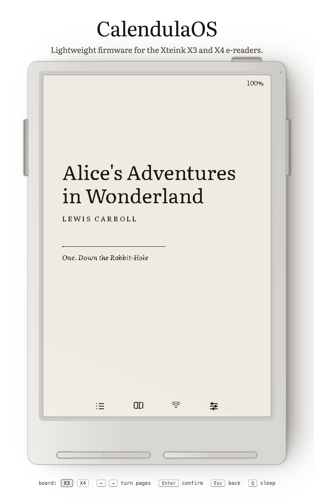

# CalendulaOS

Open firmware for the Xteink X3 and X4 e-readers. Bare-metal Rust, `no_std` on
an ESP32-C3, no heap on the reading path, ~424 ms page turns on the X3 (379 ms
of which is the panel itself).

[](docs/FLASHING.md)
[](docs/CUSTOM_FONTS.md)
[](docs/ARCHITECTURE.md)

<p align="center">
  <picture>
    <source media="(prefers-color-scheme: dark)" srcset="docs/home-dark.png">
    
  </picture>
</p>

To look before you flash, [try the emulator](https://chongfun.github.io/calendula-os/)
in your browser — the firmware's own app and rendering code compiled to
WebAssembly, driving a simulated e-ink panel with a shelf of public-domain
books.

## Features

### Reading

- **EPUB 2 & 3** — native table of contents for each (EPUB 3 nav, NCX fallback)
- **Typography you control** — Literata or Merriweather, plus an optional custom
  typeface from the SD card; three sizes, two weights, three line spacings
- **Portrait or landscape** — both landscape holds; front buttons swappable
- **Whole-book pagination cache** — paginates once, reopens in tens of ms; a
  first open publishes pages progressively so you can start reading immediately
- **Fast page turns** — ~45 ms of firmware work per turn; the rest is panel BUSY
- **Refresh policy** — fast only, clean on wake, or periodic clean pass
- **Durable progress** — two-generation writes so an interrupted flush never
  loses your place

### Library & sync

- **Streamed catalog** — library size isn't bounded by RAM
- **Local Wi-Fi shelf** — upload, list, and delete books from your browser
- **Zero-config onboarding** — no stored credentials? the reader raises a
  WPA2 hotspot with a per-session password, captive portal, and QR code
- **Per-book cache clearing** — drop one book's cache without touching the
  book or anything else on the card

### Installing & recovery

- **Three ways in** — the web flasher over USB, an SD-card image for units that
  shipped with USB flashing disabled in eFuse, or an in-app update from the card
- **A recovery anchor** — updates install to the far OTA slot and slot 0 stays
  pinned as the anchor, so holding **Back + Up** at reset boots back into it

## Devices

The **X3 is the reference board** — developed, bench-measured, and selected by
default in the emulator and web flasher. The X4 is fully supported;
`tools/check.sh all` covers both boards. The maintainer only has an X3, so X4
changes are host-verified.

The board is a compile-time feature (workspace default is X4); X3 commands carry
`--features device-x3`.

## Development

Install Rust with `rustup`, then the firmware target and the flashing tool:

```sh
rustup target add riscv32imc-unknown-none-elf wasm32-unknown-unknown
cargo install espflash
./tools/install-hooks.sh                                  # optional: git hooks for local feedback
```

```sh
tools/cargo.sh run -p fw --release --features device-x3   # build, flash, serial monitor
tools/check.sh fast                                       # fmt, clippy, host tests
tools/check.sh emulator                                   # X3 + X4 golden frames
tools/check.sh all                                        # complete required Rust/firmware verification, before a pull request
```

Only flashing needs the device on USB; everything else builds and tests on a
plain host. Host-side Cargo commands need an explicit `--target` because the
workspace defaults to the firmware target.

The browser emulator builds one wasm per board:

```sh
tools/build-web.sh _site                # X3 + X4 wasm + index.html into _site/
python3 -m http.server -d _site 8000    # http://localhost:8000 — add ?board=x4 for the X4
```

`.github/workflows/pages.yml` publishes on push to `main`.

Hardware bench runs live in `tools/bench`. Run `page-turn` and `sleep-sync`
after display, input, sleep, or SD changes; save soak/storage runs for risky
merges and releases.

```sh
tools/bench/bench.py channel-stress --host                        # host-only concurrency checks
tools/bench/bench.py page-turn --port /dev/cu.usbmodem101 --turns 50
```

## Flashing

`tools/cargo.sh run` flashes over USB. Tagged releases publish app and SD
images for units without a toolchain or with USB disabled;
[docs/FLASHING.md](docs/FLASHING.md) covers all three paths.

## Documentation

- [docs/ARCHITECTURE.md](docs/ARCHITECTURE.md) — tasks, ownership rules, memory
  budget, and the measured performance table
- [docs/FLASHING.md](docs/FLASHING.md) — partition layout, release images,
  locked units, in-app updates, and the recovery hatch
- [docs/CUSTOM_FONTS.md](docs/CUSTOM_FONTS.md) — building and installing a
  custom typeface
- [AGENTS.md](AGENTS.md) — the working contract for changes to this repository

## Credits

- [Jon-Vii's MarigoldOS](https://github.com/Jon-Vii/marigold-os), which
  CalendulaOS is a fork of
- [Literata](https://github.com/googlefonts/literata) and
  [Merriweather](https://github.com/SorkinType/Merriweather) (both OFL) for the
  reading typefaces
- [The OpenX4 community SDK](https://github.com/open-x4-epaper/community-sdk)
  for panel addressing behavior
- [Crosspoint Reader](https://github.com/crosspoint-reader/crosspoint-reader)
  for the community reverse-engineering behind X3 device support

## License

MIT
