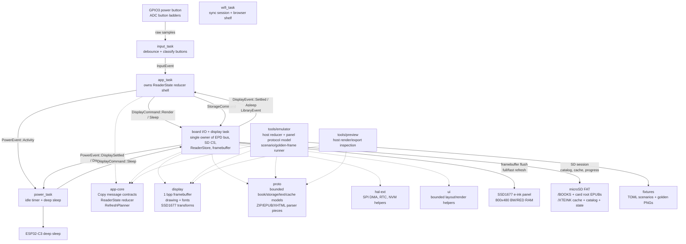

# CalendulaOS architecture

This firmware is a bare-metal Rust reader OS for the Xteink X4 and X3 e-ink
readers: ESP32-C3, monochrome e-paper panels, no PSRAM.

The design goal is not to imitate a desktop OS. It is a small data pipeline:

```text
buttons -> app state -> display command -> framebuffer -> SSD1677 RAM -> refresh -> sleep
```

## Current architecture diagram



## Rules

- `#![no_std]`, no heap allocation in the reading path. The one
  exception is the Wi-Fi sync session, which donates loaned buffers to
  esp-alloc and ends in a reset (see "Wi-Fi sync session").
- One 48 KB 1 bpp framebuffer.
- Display ownership is single-writer: only `display_task` touches the EPD bus.
- Reader state ownership is single-writer: only `app_task` mutates page/menu state.
- Messages are small `Copy` values. Bulk bytes stay in caller-owned buffers.
- Power requests display sleep through `display_task`; it never touches SPI.
- Hardware assumptions live in one of two places:
  - X4 board wiring in `fw/src/main.rs` and `fw/src/tasks/input.rs`.
  - SSD1677 protocol in `display/src/epd.rs`.

## Workspace

```text
app-core/ app state reducer and Copy message contracts shared by firmware/tools
display/   framebuffer, drawing primitives, SSD1677 constants and address math
hal-ext/   thin async wrappers over ESP HAL peripherals
fw/        boot, Embassy executor, task wiring, board-owned peripherals
ui/        shared shell rendering plus ui::reading, the reader page-plan seam
           (page bounds, ink measurement, wrapping) used by fw and host tools
proto/     bounded book/storage/text/cache models plus ZIP/EPUB/XHTML parser pieces
tools/emulator/ host-side development emulator and scenario runner
tools/cargo.sh  rustup-stable Cargo wrapper for firmware builds/checks
tools/bench/    serial bench harness for hardware timing, storage/cache,
                sleep, soak, and host channel-stress checks
```

## Embassy tasks

```text
app_task
  owns ReaderState
  InputEvent -> DisplayCommand::Render
  modes: Home, Library, Reading, Chapters, Sync, Settings

board_io/display task
  owns EpdBus, SD CS, ReaderStore, and Framebuffer
  DisplayCommand::Render -> pure framebuffer render from the current ReaderStore snapshot
  StorageCommand::* -> serialized SD/FAT/catalog/cache work on the shared SPI bus
  DisplayCommand::Sleep -> sleep screen full refresh -> SSD1677 deep sleep -> PowerEvent::DisplayAsleep
  sends DisplayEvent::Settled to app_task when render completes

input_task
  polls GPIO3 and ADC ladders
  debounced ADC/power edges -> reader Button actions -> InputEvent

power_task
  observes activity and display-settled events
  asks display_task to sleep the SSD1677, then enters ESP32-C3 deep sleep

wifi_task
  parked until SyncCommand::Start arrives from the Wireless screen
  requests StorageCommand::LoanSyncMemory, receives the dismantled EPUB
  scratch as radio heap, joins Wi-Fi in STA mode, reports SyncEvents to
  app_task, then serves the browser shelf page at the device's LAN address
  SyncCommand::Exit (the done press) ends the session with a software reset
```

## Wireless session

The wireless session is one-way and modal because the radio blob needs ~100 KB of
heap this firmware does not have while reading. `fw::sync_mem` owns the
plumbing: the display task dismantles the EPUB scratch into raw regions
(`reader_cache::dismantle_scratch`), and the wifi task donates them plus a
16 KB claim on the otherwise unused dram2 boot-loader shadow segment to
esp-alloc. The previous-frame framebuffer also lives in dram2 now so
esp-wifi's static demand fits in main DRAM with the ~41 KB stack region
intact. The smaller scratch buffers are reused directly as TCP socket and
HTTP buffers. Once loaned, the reader pipeline cannot come back: leaving
the Wireless screen after the radio ran maps to `SyncCommand::Exit`, which is
a software reset; boot restore then reloads the saved position.

Before the loan the display task flushes any coalesced reading position
to STATE.BIN, because the session's only exit is the reset. (An earlier
iteration also exchanged the position with a kosync server here; that
shipped unused and was removed — the session is purely a book server.)

Once joined, the wifi task serves a shelf page at the device's LAN
address (the Wireless screen's `Serving` status hands out the URL, with
Confirm as the done key). The
page lists the catalog, shows real upload progress, and offers per-book
removal. Routes: `GET /` serves the page, `GET /list` returns the catalog
snapshot shipped with the loan, `POST /upload?name=` streams raw EPUB
bytes, and `POST /delete?name=` removes a book (card-root entries carry
`root=1`; uploads always land in /BOOKS). Upload bytes reach the display
task — still the single SD owner — through `fw::upload`'s two-buffer
ping-pong: 4 KB chunks carry loaned buffers one way and the buffers come
back on a return channel once written. The display task holds one SD
session for the whole upload phase and writes `/BOOKS/<8.3>.EPU` (the
catalog scan accepts `.epu` alongside `.epub`), recording the browser's
original filename in a `/XTEINK/LABELS/<stem>.TXT` sidecar so the shelf
and Library can label the book with it. The done press waits for
any in-flight upload before the session-ending reset; the boot rescan
then surfaces the new books.

Station credentials come from `/XTEINK/WIFI.BIN` (written by the
onboarding portal below), falling back to compile-time `option_env!`
values (`XTEINK_WIFI_SSID`/`XTEINK_WIFI_PASS`) for dev builds.
At boot the display task reads WIFI.BIN once and reports the saved
network's name as `SyncEvent::NetworkSaved`, so the Wireless screen can
show which network is saved and offer connect/forget honestly instead of
guessing from build flags. Forget is a two-press flow (the browse key
arms it, Confirm deletes WIFI.BIN via
`StorageCommand::ForgetWifiCredentials`) and is only reachable while the
radio is untouched; it drops the screen back to the set-up offer — the
recovery path for a wrong password or a changed router that used to
require editing the card on a computer.

With no credentials anywhere, starting a session raises the onboarding portal
instead: an open `XTEINK-X4` hotspot at 192.168.4.1 with a captive DHCP
server, a DNS catch-all (every name resolves to the portal, which makes
phones raise their sign-in sheet unprompted), and a credential form on
port 80. The Wireless screen shows a baked-at-build-time join QR
(`tools/generate_qr.py`). Submitted credentials travel to the display
task as a `StoreWifiCredentials` Copy message, land in WIFI.BIN, and the
next session joins as a station. `proto::captive` holds the sans-IO
DHCP/DNS/HTTP codecs under host tests; the wifi task only owns sockets.

Embassy is used for cooperative waits: ADC retry delays, button polling, SPI DMA
transfers, BUSY waits, and sleep windows all yield instead of spinning. The real
battery win comes after display settle: the power task asks the display task to
draw a visible sleep screen, power down the SSD1677, then move the ESP32-C3 into
deep sleep. The power button also requests this same sleep path instead of being
treated as ordinary navigation input.

Input/render backpressure is intentionally coalesced. The app keeps at most one
display render in flight. While the display is refreshing, new button events
still update `ReaderState`, but they set a single pending-render flag instead of
queuing stale framebuffer renders. When `DisplayEvent::Settled` arrives, the app
renders the latest state once.

Storage is also explicit. Files/Home/Reading transitions enqueue
`StorageCommand`s after the visible render settles; render commands never scan
FAT, open EPUBs, build caches, or write progress. Open/extend requests whose
page already sits inside the loaded section window are answered from RAM
without an SD session, and reading-progress writes are coalesced (at most one
STATE.BIN write per 15 s, flushed before display sleep). The board I/O task is still
the single SPI owner, so display refresh and SD transactions cannot overlap, but
the user-facing view is always drawn from the latest already-owned snapshot.
SD/FAT access goes through an SD session: the board I/O task deselects the
display, clocks the bus down for the card (400 kHz identification with wake
clocks, then 20 MHz data), opens the FAT root, performs one storage action, and
restores 40 MHz display SPI before returning to EPD work. The card stays powered
between sessions while the device is awake, so only the first session runs the
full CMD0/ACMD41 init; later ones reuse the remembered card type and skip the
handshake, falling back to a cold init if a reused session cannot open the
volume. Deep sleep resets the chip and clears that state.

## Display model

`display::fb::Framebuffer` is the source of truth. White is bit `1`, black is
bit `0`, row-major, 100 bytes per row.

The SSD1677 path writes the current framebuffer to BW RAM (`0x24`). The first
refresh after boot also writes the current framebuffer to RED RAM (`0x26`) and
runs the multi-flash full waveform (~3.5 s), the only mode that reliably clears
unknown pixels. Normal page turns use a second retained framebuffer as the RED
RAM previous-frame source, then trigger the SSD1677 fast waveform (~421 ms).

Between those sits `RefreshMode::FastClean`, the one-flicker clean: the
display-mode-1 waveform run with the temperature register overridden to 90 C,
selecting the hotter (shorter) OTP LUT — ghost cleanup in ~1.5 s at a small
contrast cost. Waking from the sleep screen and view/context changes use it
instead of the full waveform, since the panel's contents are known. After a
FastClean settles, the update sequence reloads the sensed temperature so later
fast refreshes return to sensor-accurate timing.

The user-facing `RefreshPolicy` in Settings selects between `FastOnly`,
`FullOnWake` (the default), and `FullEveryTen`, which inserts a FastClean
cleanup after every ten fast refreshes.

`display::epd` contains three transform constants currently validated during bring-up:
`MIRROR_X = true`, `MIRROR_Y = false`, and `REVERSE_BITS = true`. The logical
framebuffer API stays upright while firmware and host tools remap bytes/bits
before panel-RAM writes. This fixes the X4 panel's observed horizontal byte
order and bit order without leaking hardware orientation into app rendering.
`MIRROR_Y=true` was tested and rejected because it made glyphs vertically
mirrored/upside down.

Physical orientation is an app/layout concern, not an SSD1677 streaming concern.
The current readable build places logical top on the physical button side. The
reader state already carries a complete orientation enum:

```rust
enum DisplayOrientation {
    LandscapeButtonsBottom,
    LandscapeButtonsTop,
    PortraitButtonsLeft,
    PortraitButtonsRight,
}
```

Default reader mode is `LandscapeButtonsBottom`, but the low-level display
transform above should stay fixed unless corruption returns.

Addressing follows the OpenX4 community SDK behavior:

- SPI mode 0, 40 MHz.
- BUSY is active high.
- X window is pixel-addressed, `0..799`.
- Y gate scan is reversed, so the full Y window is `479..0`.

## Data-oriented design

State is plain data, not object graphs:

```text
InputEvent        Copy enum
ReaderState       view/book/page/chapter/settings/battery fields
RenderRequest     view/book/page/orientation/refresh/battery/dirty rect
Layout<N>         parallel arrays of kind/rect/parent/text span
Framebuffer       single flat byte array
```

`app-core` owns the reader reducer and the shared message contracts. The
firmware `app_task` is an Embassy shell around this pure reducer, and host tools
use the same reducer for deterministic navigation tests. This keeps button flow,
library events, restore events, orientation, refresh policy, and render requests
from drifting between device and emulator.

EPUB work keeps the same shape:

```text
SD file -> ZIP entry -> inflate window -> XML token -> flat cache record -> glyph blit
```

No DOM, no heap object graph, and no entire-book-in-RAM reader model. Parsers
are allowed to be state machines, but their output is immediately flattened into
bounded records.

`proto` owns the reader data contracts shared by Home, Files, Reading, Chapters,
and the host preview tool:

- `BookMeta`, `BookProgress`, and `ChapterMeta` for catalog and progress data.
- `BookStorage` and `FileCandidate` for microSD-backed `.epub` discovery.
- `ZipArchive` for host-side central-directory lookup and stored/deflated entry
  reads into caller-owned buffers.
- `ZipStream` for central-directory lookup and entry reads through a bounded
  `ReadAt` interface, which is the path storage-backed EPUBs use. Firmware ZIP
  reads stream deflate input through a reusable inflater scratch state, so large
  compressed members do not have to fit in the compressed scratch buffer.
- `EpubZipOps` as the narrow zip-entry interface cache loaders program
  against. Both zip front-ends implement it, and one shared streaming inflate
  engine sits behind them, so entry reads behave identically regardless of
  whether compressed bytes come from random-access or forward-only storage.
- `EpubPackage` for container/OPF metadata, manifest, and spine. Spine and
  manifest strings are stored as offset+length spans into the shared OPF
  text rather than inline strings, halving each item's size so long books
  (192-item spine cap, 224-item manifest cap) fit within the tight
  EPUB-open stack budget.
- `xhtml_blocks_to_sink` with `TextRole`, `FontStyle`, and `TextAlign` as the
  single XHTML extraction path feeding bounded block records.
- `BookV2Header` with `BookV2SectionRecord`, and `SectionV2Header` with
  `PageRecord`, `BlockRecord`, and `TocRecord`, for the bounded binary cache
  records the firmware reads and writes. The earlier `BookCacheHeader`,
  `SectionHeader`, `PageCacheHeader`, `LineRecord`, and `WordRecord` remain in
  `proto::cache` only for the disabled V1 migration path.

The firmware still ships one built-in catalog entry as a fallback, but the
board I/O task owns the shared SPI bus while it scans FAT16/FAT32
microSD cards for EPUBs under `/books` and then the card root. X4 SD pins are
configured on the shared SPI bus (SCK GPIO8, MOSI GPIO10, MISO GPIO7, SD CS
GPIO12). SD transactions and display refreshes remain serialized by that single
board-I/O owner.

## SD-backed reader cache

The SD reader uses a V2 whole-book cache. Opening an EPUB parses OPF/TOC/spine,
then builds the whole book up front: every spine item paginates into one or more
fixed-size sections, each section is written to its own file, and a book index
records where each section sits. After that the book reopens from cache in tens
of milliseconds; only the first build of a large book is slow (minutes for
something HPMOR-sized).

A chapter is a spine item, and a long one paginates into several sections. The
builder closes the current section and opens the next when its in-RAM arena
fills, where the text budget (16 KB) is the binding limit for prose, well ahead
of the block (384) and page (96) caps. Sections are invisible while reading: the
reader walks across them seamlessly, and the footer page-in-chapter counter
aggregates every section sharing a spine. The book index holds up to
`MAX_BOOK_SECTIONS` (320, on the order of 4,500 pages); a longer book caches
`partial`.

Each section header carries a `font_config` that packs `READER_LAYOUT_VERSION`
with the type size and spacing it was paginated under. A loaded section whose
version or size no longer matches is invalid and forces a rebuild, so bumping
`READER_LAYOUT_VERSION` retires every stale cache after a layout or
cache-encoding change; a spacing-only change re-walks line heights without a
reparse.

Cache paths use FAT 8.3-safe names because `embedded-sdmmc` operates on short
file names in the firmware path. The library list is a windowed catalog
snapshot at `/XTEINK/CATALOG.BIN` (v3: `X4CT` magic, u16 book count, 92-byte
records). Firmware streams it `LIBRARY_WINDOW` (16) entries at a time instead
of holding the whole list in RAM, so library size is bounded by the card, and
only window crossings re-read it. The currently open book sits in a separate
`active_entry` so the reading path never depends on where the list is
scrolled. On boot/refresh, firmware first loads a window from the cached
snapshot, then refreshes `/BOOKS` and card-root discovery in a storage
command, streaming the fresh catalog out in batches without ever holding it
whole. Entries are labeled with the book's real title from its cached
`BOOK.BIN`, falling back to the stored original-filename label for uploaded
8.3-named books, then to the prettified file stem. Each fresh catalog write
also sweeps `CACHE2` and reclaims caches whose stored source identity no
longer matches any catalogued book, deleting the data files and the emptied
directories while leaving `STATE.BIN` intact. Files renders the current
snapshot immediately. It may show “Library unavailable” before any successful
cache/scan, and “No books found” only after a completed scan proves the card
has no EPUBs.

```text
/XTEINK/CACHE2/E<hash>/BOOK.BIN
/XTEINK/CACHE2/E<hash>/TOC.BIN
/XTEINK/CACHE2/E<hash>/COVER.BIN
/XTEINK/CACHE2/E<hash>/SECTIONS/S000.BIN
/XTEINK/CACHE2/E<hash>/SECTIONS/S001.BIN
/XTEINK/CATALOG.BIN
/XTEINK/LABELS/<stem>.TXT
/XTEINK/STATE.BIN
```

`BOOK.BIN` holds a `BookV2Header`, one `BookV2SectionRecord` per section (spine,
start page, page count, partial), TOC records, and a string blob for title,
author, and TOC titles. Section files hold a `SectionV2Header`, page records,
block records, per-block paragraph flags, and the UTF-8 text blob of that
section's pre-wrapped lines. `TOC.BIN` is a per-book chapter-list sidecar for
the Chapters overview, distinct from the TOC records inside `BOOK.BIN`.
The active firmware state keeps only loaded book
metadata, the full section index, the active section's page/block records and
text bytes, and small ZIP/XML scratch buffers. Spine XHTML members of any size
stream completely through the resumable block parser in bounded inflate
windows, so chapter content is never truncated by scratch-buffer limits. `STATE.BIN`
stores the encoded `AppStateRecord`; version 2 and later records include the
SD source size and path-derived hash so boot restore can map saved progress
back onto the scanned SD catalog instead of trusting a volatile list index.
The current version 3 also persists the type settings (font size and line
spacing).

`COVER.BIN` is an optional Home-cover sidecar for the same cache key. It stores
a tiny header followed by a 202x303, 1-bit, row-packed bitmap matching the Dock
Clean cover slot. Firmware treats it as flat DOD data: valid records are drawn
directly, while missing or invalid records fall back to generated cover art. The
host preview tool can generate the sidecar from EPUB JPEG/PNG covers with
`--cover-bin` or write it directly to a mounted SD cache path with `--sd-root`.

Reading and chapter navigation typography use generated Literata bitmap assets.
The host generator downloads OFL Literata TTFs and emits Latin-1 glyph
metrics/bitmaps for Regular, Italic, Bold, and BoldItalic. Firmware does not
rasterize TTFs on-device.

## Development emulator

`tools/emulator` is a host-side parity tool for fast development loops. It has a
headless scenario runner for agents/CI and an optional egui frontend for manual
interactive testing. The default build is headless; the desktop window is built
with `--features gui` to keep routine checks lightweight.

The emulator intentionally models the behavior that is useful during ordinary
development:

- app reducer state transitions from button and library events
- selected-panel 1 bpp framebuffer rendering (X4 800x480 or X3 792x528)
- shared panel byte/bit transform from `display::epd`
- SSD1677-style BW/RED RAM, address counters/ranges, refresh mode history, and
  deep-sleep command validation
- UC8253 DTM1/DTM2, LUT/CDI, prestage, power, and sleep validation driven by
  the same allocation-free refresh-operation plan as firmware
- scripted scenarios that can assert final view/book/page/selection/panel state,
  dump PNG frames, and compare against golden frames

It does not model ESP32-C3 CPU timing, ADC noise, SPI DMA edge cases, BUSY
timings, voltage/temperature behavior, or true e-paper waveform physics. Those
remain hardware-validation concerns.

## Development bench

`tools/bench/bench.py` is the hardware-facing counterpart to the emulator. It
captures serial output with the same DTR/RTS behavior as `tools/serial_capture.py`,
parses structured `bench:` telemetry, writes JSONL logs under `target/bench/`,
and reports timing/storage/sleep summaries. Current hardware suites are guided
workflows; the firmware still has no interactive serial command channel.

Use it in tiers:

- `channel-stress --host` in ordinary development when queue/coalescing,
  refresh-plan, sync-session, reader state, display command, or storage command
  behavior changes.
- short `page-turn` and `sleep-sync` runs before trusting a flashed firmware
  after display, input, sleep, reader rendering, SD session, section cache, or
  progress-write changes.
- longer `reader-soak`, `storage-cache`, and `sleep-sync` runs before releases
  or risky merges.
- `thermal-run` for targeted refresh, ghosting, sleep-screen, enclosure, power,
  SD-card, or ambient-temperature investigations.

Typical commands:

```sh
tools/bench/bench.py channel-stress --host
tools/bench/bench.py page-turn --port /dev/cu.usbmodem101 --turns 50
tools/bench/bench.py storage-cache --port /dev/cu.usbmodem101 --reset-before --seconds 20 --strict
tools/bench/bench.py sleep-sync --port /dev/cu.usbmodem101 --cycles 10
tools/bench/bench.py report target/bench/latest.jsonl
```

Typical development loop:

```sh
cargo test -p app-core -p proto --target aarch64-apple-darwin
cargo test --manifest-path tools/emulator/Cargo.toml --target aarch64-apple-darwin --no-default-features
cargo test --manifest-path tools/emulator/Cargo.toml --target aarch64-apple-darwin --no-default-features --features device-x3
cargo run --manifest-path tools/emulator/Cargo.toml --target aarch64-apple-darwin --no-default-features -- --scenario fixtures/scenarios --check fixtures/golden
cargo run --manifest-path tools/emulator/Cargo.toml --target aarch64-apple-darwin --no-default-features -- --scenario fixtures/scenarios --dump target/emulator
cargo run --manifest-path tools/emulator/Cargo.toml --target aarch64-apple-darwin --no-default-features -- --scenario fixtures/scenarios --present-dump target/emulator-presented
cargo run --manifest-path tools/emulator/Cargo.toml --target aarch64-apple-darwin --features gui -- --gui
```

## Web emulator

`tools/web-emulator` compiles the shared crates (`app-core`, `ui`, `display`,
`proto`) to `wasm32-unknown-unknown` behind a small raw C ABI (no
wasm-bindgen). `web/index.html` is a single self-contained page that hosts the
framebuffer on a canvas inside a device mockup, feeds key presses and a
monotonic clock in, and simulates e-ink refresh behavior (fast updates redraw
with ghosting only; fast-clean flickers once; full runs inversion passes).
Reading progress persists in localStorage through the same
`PersistedAppState`/`LibraryEvent::Restored` shape the firmware uses.

Parity boundary: everything rendered by the shared crates tracks firmware
changes automatically. The firmware shell (`fw/`) is not compiled; the wasm
crate carries small stand-ins for it:

- a fake SD layer: three public-domain books plus a tour, parsed from
  `tools/web-emulator/books/*.txt` (regenerated by `books/convert.py`) into
  `BlockRecord`s and paginated with the real `ui::reading` walk
- a scripted Wi-Fi session ending at `SyncEvent::Serving`
- a copy of the SD reading-screen composition from `fw/views.rs` (page body,
  page-in-chapter footer, loading book plate) — a change to that chrome in
  firmware needs the same change mirrored in `tools/web-emulator/src/lib.rs`

Build and deploy:

```sh
cargo build --manifest-path tools/web-emulator/Cargo.toml --target wasm32-unknown-unknown --release
cp tools/web-emulator/target/wasm32-unknown-unknown/release/x4_web_emulator.wasm web/
python3 -m http.server -d web   # local check
```

`.github/workflows/pages.yml` runs the same build, checks the golden frames,
exports browser-presented scenario screenshots into `images/screens/`, and
publishes `web/` to GitHub Pages on every push to main that touches `web/`, the
wasm crate, shared crates, or scenario fixtures. A tagged release dispatches
the Pages workflow with its tag, which copies that release's flash images into
the Pages artifact so the ESP web flasher can fetch same-origin firmware. The
built `.wasm` and release images are gitignored; only sources are committed.

## Reader app model

The firmware now has the e-reader surfaces as explicit app state:

- `Home`: current book cover/metadata plus Continue, Library, Sync, and Settings.
- `Library`: selects a book or opens settings.
- `Reading`: owns the active book/page position.
- `Chapters`: selects a chapter within the current book.
- `Settings`: cycles refresh policy, font size, line spacing, typeface, and
  type weight. `DisplayOrientation` is persisted for future reading-layout
  work, but it is not currently exposed as a user-facing setting.

Every surface renders in landscape: the X4 is held that way for its side page
buttons, so `Home`, `Library`, and `Settings` share the reading posture rather
than rotating into portrait. Home is cover-led: the current book is the visual
anchor, with a restrained menu down the side for Continue, Library, Sync, and
Settings.
Reading mode keeps the page quiet: tiny book title, rendered-screen count within
the chapter, symbolic battery, and a thin whole-book progress bar. Home shows a
small battery percentage because it is a status surface. GPIO0 is sampled as the
current rough battery source using a 2:1 divider assumption and a simple
3300-4200 mV LiPo percentage curve. The current book may be the built-in
fallback or the restored/last-selected microSD EPUB. Home triggers SD scan and
state restore on first render, then `Read` resumes the current EPUB through the
same cache-loading path as Files. If there is no current SD EPUB, `Read` opens
Files when EPUBs are present and falls back to the built-in reader when the card
is empty or unavailable. SD EPUBs use the same flat book/chapter/page fields as
built-in content, but page bodies come from the SD-backed cache instead of
static text arrays.

## Current module map

`fw/src/tasks/display.rs` is intentionally the only task touching the EPD bus and
coordinating SD access. It is now the orchestration layer:

```text
display task orchestration
  receives DisplayCommand
  triggers SD scan and EPUB cache loading when needed
  calls view rendering into the framebuffer
  selects refresh mode
  flushes or sleeps the panel
  publishes display/power/library events
```

The deeper modules keep implementation complexity behind narrow data-oriented
interfaces:

```text
fw::display_flush       panel-plan execution, RAM streaming, BUSY waits, and sleep
fw::library_sd          FAT scan, SD chip-select handling, and file discovery
fw::sd_session          SD session open/close and the upload write pump
fw::reader_cache        EPUB-to-cache loading into bounded proto::cache records
fw::reader_cache_files  cache/state/credential/label file records on the card
fw::reader_layout       page indexing, line wrapping, style markers, measurements
fw::reader_store        bounded loaded-book/library state shared by cache and views
fw::catalog             the built-in fallback book's static content
fw::sync_mem            the one-way memory loan for the Wi-Fi session
fw::upload              browser-to-shelf upload ping-pong plumbing
fw::views               Home/Files/Reading/Chapters/Settings drawing
fw::tasks::display      task loop, refresh policy, and event publishing
```

Do not split this by moving bus access into a second task unless there is also a
proper request/response protocol for the shared SPI bus. The current invariant
that display refresh and SD reads cannot overlap is more important than file
size.

Persistent app state is represented by `hal_ext::nvm::AppStateRecord`, a compact
versioned/checksummed record for book id, chapter, rendered screen, shell
orientation, reading orientation, refresh policy, source hash, and source file
size. The firmware stores it at `/XTEINK/STATE.BIN` for SD reading progress;
flash/NVM fallback remains separate from the record format.

## Performance

| | |
|---|---|
| Page turn | 473 ms end-to-end; 421 ms of that is the panel's rated fast waveform |
| Wake from sleep | one flicker, ~1.5 s (deep-sleep Power-button wake only: the boot reads the RTC wake cause and seeds the refresh planner with the sleep screen it knows the panel holds; a battery pull or crash boots with unknown panel contents and pays the full 3.5 s) |
| Cold-boot full refresh | 3.5 s |
| Reopen a cached book | tens of milliseconds |
| RAM | 400 KB SRAM, no PSRAM |
| Usable stack | ~43 KB |
| Framebuffer | one, 48 KB, 1 bit per pixel |

## Bring-up checklist

1. Flash firmware and confirm the reader shell appears.
2. Measure BUSY on GPIO6 during reset and refresh.
3. Confirm full refresh timing.
4. Confirm `TL`, `TR`, `BL`, and `BR` are readable and map consistently.
   Current readable transform: `MIRROR_X=true`, `MIRROR_Y=false`,
   `REVERSE_BITS=true`. Logical top currently appears on the physical button
   side; handle this later through `DisplayOrientation`.
5. Validate the Adafruit-scaled ADC ladder bands against this physical unit.
   Current calibrated bands are GPIO1 Back `2400..2700`, Confirm `1800..2150`,
   Left `1000..1250`, Right `0..100`; GPIO2 Up `1500..1800`, Down `0..100`. Raw
   hardware buttons then pass through a CrossPoint-style mapping layer into
   reader actions: front `BACK_CONFIRM_LEFT_RIGHT`, side `PREV_NEXT`. Both
   previous-page buttons emit `Previous`; both next-page buttons emit `Next`.
   Raw ADC serial logging and on-screen GPIO values are now behind debug
   constants so normal firmware only refreshes on debounced button edges.
6. Measure deep-sleep current.

Storage, saved progress, Wi-Fi sync, and the FastClean refresh mode have
all landed since this checklist was written; partial-window refresh
remains deliberately shelved.
